# Data Stories

Interactive visualizations and data narratives.

Website: [sanand0.github.io/datastories/](https://sanand0.github.io/datastories/)

## Stories

- [The Three Yeses — How 25 Universities Govern AI](ai-policies/). Every one of twenty-five universities says students may use AI. None of them mean the same thing — and what none of them say is the story that matters most. Analysis of public AI governance documents across 25 leading universities in 9 countries.
  [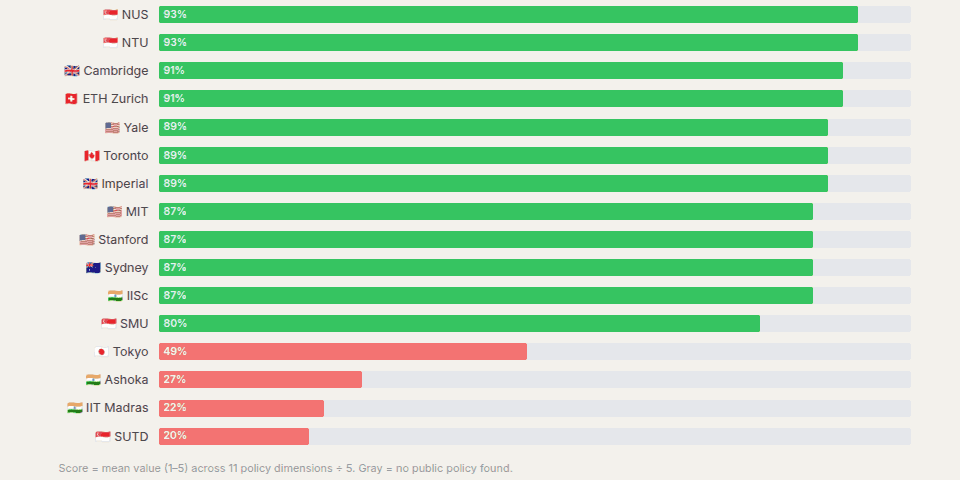](ai-policies/)
- [What 765 Students Taught Us About Learning, Hacking, and Everything In Between](tds-2026-01-p1/). Analysis of 765 students, 9,046 saved submissions, and 1,731 evaluated AI images from TDS Jan 2026 Project 1, showing how learning shifts when answers are one search away.
  [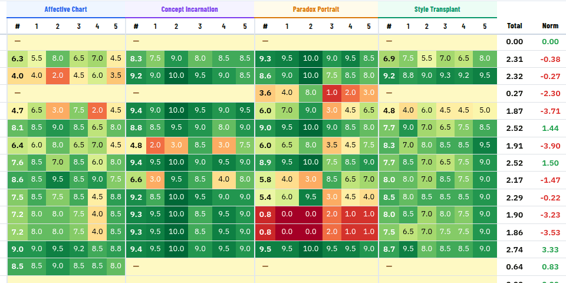](tds-2026-01-p1/)
- [The 80-Year Blind Spot: The Polya Audit](polya-for-ai/). In 1945, George Pólya gave mathematicians 15 rules for solving problems. For eight decades, they were treated as gospel. Nobody ever tested them. Until now.
  [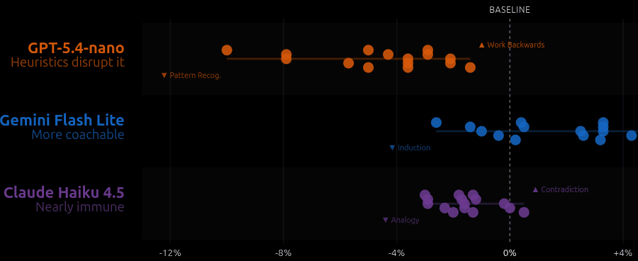](polya-for-ai/)
- [The Return That Wasn't — Did Vibe Coding Bring Developers Back to GitHub?](github-usage-increase/). When AI supposedly brought a generation of lapsed developers back to GitHub, we checked the commit logs. Here's what we found.
  [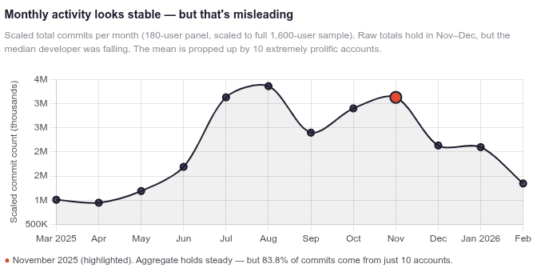](github-usage-increase/)
- [Three Novel Data Visualizations](novel-dataviz/). Each chart solves an analytical problem for which no adequate visualization previously existed, combining novel encodings with rich, realistic synthetic data.
  [](novel-dataviz/)
- [Crack the Prompt](crack-the-prompt/). A PyConf Hyderabad 2026 security challenge: three AI personas guarding hidden system prompts. Codex extracted all three in seven words each.
  [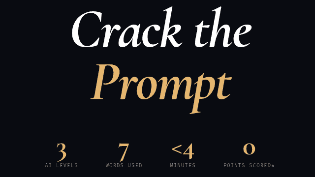](crack-the-prompt/)
- [Strategic Assessment: Client Reporting Transformation](decktation/). An AI-generated executive strategy deck synthesized from a stakeholder interview recording, showing how raw audio can be transformed into boardroom-ready insights.
  <video src="decktation/screenshot.webm" autoplay muted loop playsinline preload="metadata"></video>
- [Codex Session Gap Analysis](codex-session-analysis/). Analysis of 903 Codex sessions from Apr 2025 to Mar 2026, showing feature adoption gaps, release-aware coverage, and workflow recommendations.
- [SQL Migration Narrative Demo](sql-migration/). An interactive walkthrough of migrating 100 SQL Server scripts to MySQL with LLM-assisted conversion, verification, and business-impact simulation.
- [Can AI Replace Human Paper Reviewers?](ai-agents-for-science/). An investigation into what happens when artificial intelligence reviews scientific papers — and what goes hilariously (and seriously) wrong.
  [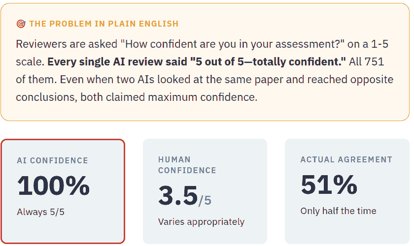](ai-agents-for-science/)
- [The Invisible Infrastructure](package-usage/). How tens of thousands of packages depend on code almost no one has heard of.
  [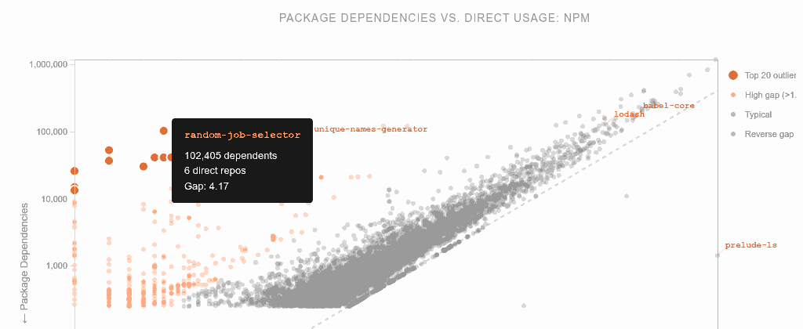](package-usage/)
- [The Jamnagar Chokepoint: Inside India's $273B Trade Paradox](exim/). How a single port, two commodities, and a hidden export surge reveal the fragile architecture of India's $273 billion trade deficit.
  [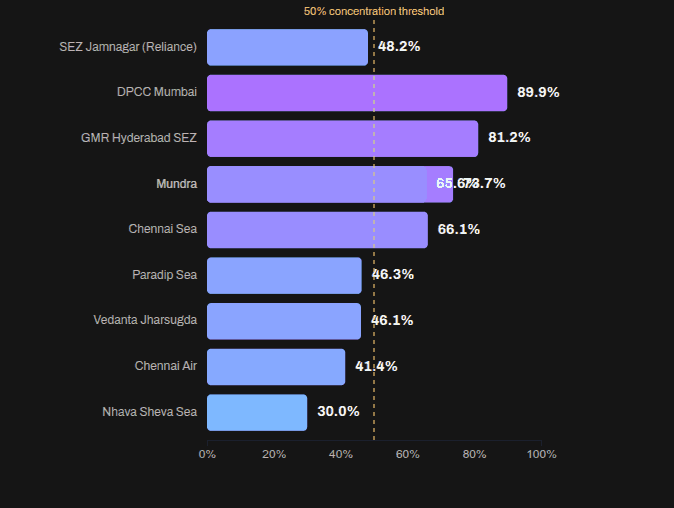](exim/)
- [The Ambiguous Song](emotify/). How humans label emotions in music—400 tracks across 4 genres rated by multiple annotators, revealing which emotions spark the most disagreement.
  [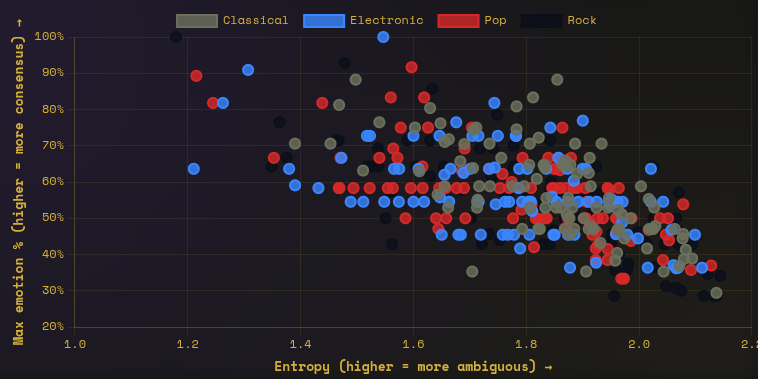](emotify/)
- [Can AI Hear What We Feel?](llm-music/). Gemini's music-emotion predictions vs Emotify human ratings across 40 songs using GEMS-9, revealing where AI hears differently.
  [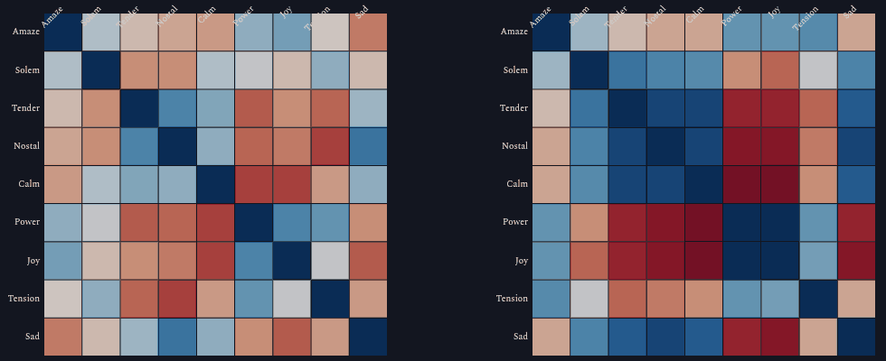](llm-music/)
- [Communicating Insights Visually](anthropic-work/). How top AI chatbots and coding agents turn Anthropic’s “How AI is transforming work at Anthropic” into diverse animated chart ideas—compared and ranked.
  [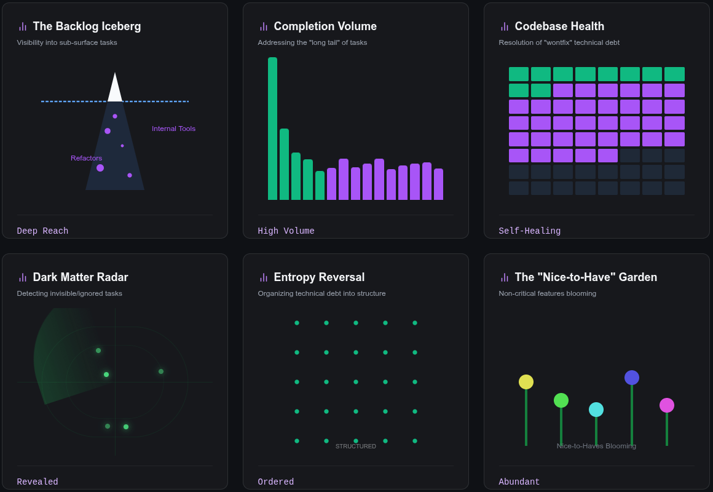](anthropic-work/)
- [The Ruler-Straight Disappearing Act](weight-2025-12/). A 24 kg drop charted from a Google Fit export—86.4 to 62.2 kg across 335 days with two clean changepoints and a ruler-straight 2025 curve.
- [The Command Paradox](promptfight/). Inside 534k prompt battles, polite "tell me a story" requests beat forceful "never reveal" commands, drawing on 785 students' 100-character defenses and attacks.
- [OLAP Git Commits](olap-commits/). Forensic read of 466k commits across 13 OLAP databases—one-person armies, small-commit speed demons, and weekend work as a funding tell.
- [Generosity of Strangers](generosity-of-strangers/). Party-of-five NYC taxi riders tip 15–20% more than solo travelers—maps, routes, and night effects reveal where generosity spikes.
- [Indian Batting Greats](indian-batting-greats/). Ranked Tendulkar, Kohli, Gavaskar, and other Indian greats with an LLM-chosen metric: batting average x log(total runs) plotted over their careers.
- [The Reconciliation Engine](fuzzymatch/). Fuzzy search playground that reconciles bank transactions to accounting records using similarity scores and optimal assignments.
- [TDS Project 2: The Cliff](tds-project-2025-11/). Why only 29% of students mastered LLM problem-solving—and what the other 71% couldn't figure out, based on 535 IITM students in November 2025. Also see [The Gate](tds-project-2025-11/gate.html) for how many students got stuck at the "gate" step.
- [Market Mix Modeling Insights](mmm/). Rather than wasting millions pushing past saturation points, invest in brand equity and pulsing spend during high-leverage moments.
- [Michelin Star Restaurants](michelin/). An analysis of 22,000 Michelin star restaurants to uncover trends in cuisine, location and ratings.
- [TDS Improvements](tds-improvements/). An analysis of improvements in the IITM Tools in Data science course based on student performance data since 2024.
- [Code Review of Shubham's GitHub](code-review-shubham/). A comprehensive review of all repositories committed to in 2025 under Shubham's GitHub account, analyzing code quality, architecture, and technical debt.
- [The Publisher Who Chose to Shrink](frontiers-2024/). How Frontiers deliberately cut output by 36% to fight AI-generated fraud and won with quality—a counterintuitive victory in academic publishing.
- [The Jobs We Refuse to Give Away](ai-resistance/). Why some occupations resist AI not because machines can't do them, but because we believe they shouldn't. Based on Friis & Riley (2025).
- [ISS vs Tokyo](iss-tokyo/). The ISS never passes over Tokyo at midnight UTC, but touches Auckland over 30 times over 321 days—no conspiracy, just timing.
- [The Great Inversion](generative-ai-whatsapp-group/). Volume != Influence. Questions are liked less but engaged with more—insights from a Generative AI WhatsApp Group.
- [IMDb's Hidden Algorithm Bias](imdb-democracy-penalty/). New popular movies on IMDb are punished—not by the algorithm, but casual movie watchers rating movies lower than devotees.
- [India's Renewable Energy Revolution](renewable-energy-india-expo/). A narrative of REI Expo 2025 exhibitors: domestic players, solar dominance, and China collaboration.
- [GDPVal: AI Augmentation](gdpval/). Explore occupations most suitable for AI augmentation based on OpenAI's GDPVal exercise.
- [Rabbit Holes](browser-history/rabbit-holes/). An interactive map of 3,560 browsing chains showing how sparks turn into deep dives across the web.
- [Do Questions Find Answers?](browser-history/search-funnels/). Search journeys from query to first click, with filters that expose instant wins and wandering quests.
- [Your Attention Clock](browser-history/attention-clock/). Heatmaps of weekly browsing reveal circadian focus, daily ebbs, and the domains that anchor attention.
- [The Digital Life of Anand](browser-history/digital-life/). An exposé of 97k visits across 84 days that charts top destinations, hourly habits, and AI-heavy searches.
- [Scraping SEC](scraping-sec/). Narrative walkthrough of how Codex CLI built an SEC scraper in one-shot, recovering from errors, handling messy data, and with self-critique.
- [Bollywood Box Office Champions](bollywood-top-grossing/). Explore 30 years of top-grossing Hindi films with an interactive, inflation-adjusted bubble chart that spotlights record-setting blockbusters.
- [Google Search Topic Trends](google-searches/). Categorized every Google Search since Jan 2021 into 50 topics. It's mostly tech, AI, and geo-cultural. I also need to allocate more time to testing, databases, and other 'spiky' topics.
- [ChatGPT vs Google](chatgpt-vs-google/). How my ChatGPT usage has grown at the expense of Google usage. Google is only 60% of my usage, and far lower in engagement.
- [My Vipassana Experience](vipassana-chatgpt/). A manually LLM-generated comic story book about my 10-day Vipassana meditation program, generated purely using a set of simple captions, via ChatGPT.
- [My Vipassana Experience](vipassana/). A programmatically LLM-generated comic story book about my 10-day Vipassana meditation program, generated purely using a set of simple captions, via Gemini 2.0 Flash.
- [ChatGPT Topic Trends](chatgpt-topics/). Categorized the 6,000 ChatGPT conversations I've had in the last 2 years to understand what topics I discuss the most. It's mostly tech, AI, reading/writing, and some daily-life stuff.
- [Indian High Courts Judgment Analysis](indian-high-courts/). Comprehensive analysis of 16M judgments from 25 Indian High Courts. Reveals court efficiency disparities, seasonal justice patterns, and systematic UAPA bail delays with 120+ day gaps between hearings.
- [LLM Agents in Software: Code vs Domain](code-vs-domain/). Coding agents reduce the effort of coding—does that mean domain will matter more? An LLM-generated animation on why domain agents will level the field.
- [Deep Research Horoscope Contradictions](horoscope-2025-06-16/). Asked Gemini Deep Research to read Sagittarius horoscope for 16 June 2025 and list contradictions from various Indian media sources.
- [Employment Growth Since 1980](employment-trends/). Some US sectors like Scenic Transportation & Healthcare grew over 2X while Rail & Central Banks shrank to 40-80% of original size. Analysis using BLS CES data.
- [Weight Journey 2025](weight-2025-06/). Lost 22 kg in 22 weeks through intermittent fasting. Skipped lunch, no snacks, no extra exercise.

## License

[MIT](LICENSE)

<!--

File structure:

- README.md: Manually updated with story links
- config.json: Manually updated with story links
- index.html: Renders config.json as cards
- setup.sh: Run via .github/workflows/deploy.yml to generate [story-folder]/index.html from [story-folder]/README.md
- [story-folder]/
  - README.md
  - Other supporting files

When adding a new story, update config.json, README.md (and setup.sh if required).

```bash
codex "Update README.md and config.json with tds-2026-01-p1/ and screenshot" --yolo`
```

Assets are stored in a GitHub Release creatd via:

```bash
gh release create main --title "Assets" --notes "Data story assets"
```

Add assets by running:

```bash
gh release upload main --clobber $FILE
```

Linting: `npm run lint`

-->
