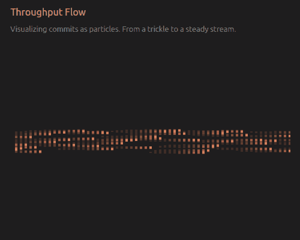
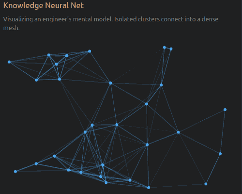
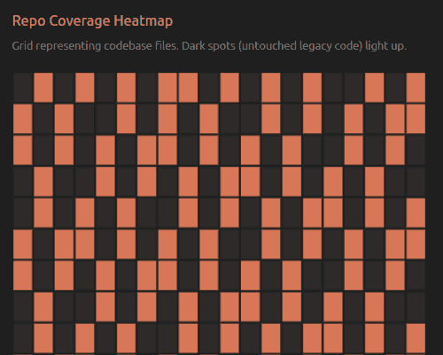
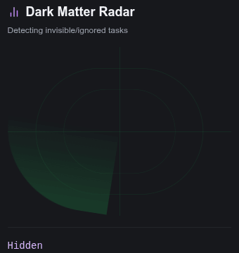
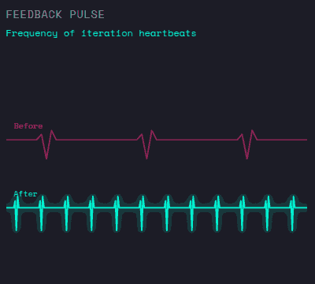
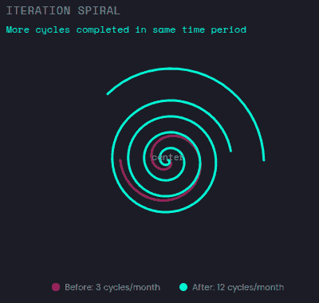
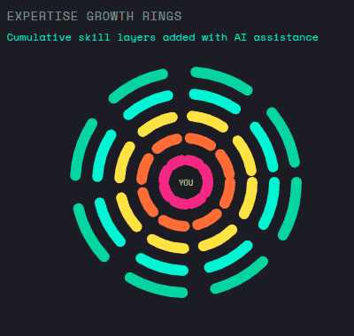
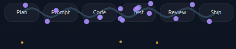
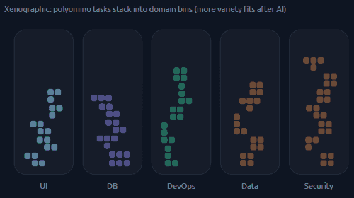
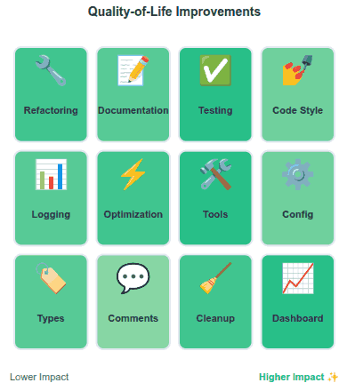

# Communicating Insights Visually

Anthropic published an article on [How AI is transforming work at Anthropic](https://www.anthropic.com/research/how-ai-is-transforming-work-at-anthropic).

We wanted to see whether LLMs can suggest visualization ideas to illustrate the ideas in the paper.

<video controls width="1173" height="815" style="max-width: 100%; height: auto;" autoplay loop>
  <source src="screenshot.webm" type="video/webm">
  <a href="screenshot.webm">Video</a>
</video>

To generate this, we [converted the article to Markdown](article.md) and used the following prompt:

> This article is about how AI is transforming work at Anthropic. Suggest how the following engineer productivity patterns can be illustrated using interactive animated charts, graphs, or infographics.
>
> Specifically show the before-vs-after impact of AI on these engineer productivity patterns:
>
> 1. Engineers are getting a lot more done, becoming more "full-stack" (able to succeed at tasks beyond their normal expertise)
> 2. Engineers are accelerating their learning and iteration speed (tighter feedback loops)
> 3. Engineers are tackling previously-neglected tasks.
>
> For each pattern, I want 3 different animated graphs.
>
> - Define metrics before coding. Pick what will best illustrate the pattern. Generate REALISTIC synthetic data when required, grounded in the article.
> - Be diverse. Xenographics are welcome. Novel animation / interaction styles, artistry, xenographics, and diverse chart types are encouraged.
> - Be intuitive. A single glance should tell them exactly what insight we are trying to convey.
> - Ensure animation. It should be smooth, engaging, and visually appealing. Interactivity is a plus.
>
> Render this as a single HTML file with tabs for each productivity pattern, and a gallery of animated charts for each pattern.
>
> Here is the article:
>
> {insert article here}

... with the top AI chatbots / coding agents. Here are the results and chats, sorted by quality:

| Rank | Quality | AI Tool                                        | Chat                                                                                          |
| ---: | :-----: | ---------------------------------------------- | --------------------------------------------------------------------------------------------- |
|    1 |   🟢    | [Gemini Canvas](gemini/)                       | [💬 Chat](https://github.com/sanand0/datastories/blob/main/anthropic-work/gemini/log.md)      |
|    2 |   🟢    | [Gemini Canvas v2](gemini2/)                   | [💬 Chat](https://github.com/sanand0/datastories/blob/main/anthropic-work/gemini2/log.md)     |
|    3 |   🟡    | [Claude Artifacts](claude/)                    | [💬 Chat](https://claude.ai/share/d9f0ddb0-1b22-461f-a47f-0e35b7ae9626)                       |
|    4 |   🟡    | [ChatGPT Canvas](chatgpt/)                     | [💬 Chat](https://chatgpt.com/share/69411384-8570-800c-b375-7926a78fa991)                     |
|    5 |   🟡    | [Claude Code](claude-code/)                    | [💬 Chat](https://github.com/sanand0/datastories/blob/main/anthropic-work/claude-code/log.md) |
|    6 |   🟡    | [Codex CLI](codex-cli/)                        | [💬 Chat](https://github.com/sanand0/datastories/blob/main/anthropic-work/codex-cli/log.md)   |
|    7 |   🔴    | [Grok 4.1 Beta](grok/)                         | [💬 Chat](https://x.com/i/grok/share/WSmgpSEKre0RzSlwyGOo9Yr5u)                               |
|    8 |   🔴    | [GitHub Copilot + Grok Code Fast 1](opencode/) | [💬 Chat](https://github.com/sanand0/datastories/blob/main/anthropic-work/opencode/log.md)    |

Then, we extended it with:

> Look closely for errors in your output and fix them.
>
> Extend to 3 more animated graphs each.
> Be more diverse. Your aim is to give me creative ideas.
> Xenographics are welcome. Novel animation / interaction styles, artistry, xenographics, and diverse chart types are encouraged.

For the local coding agents, we added this line:

> Use CDP at localhost:9222 to load the page and check for console errors, screenshots, etc. The page can be loaded from http://localhost:8000/...

| Rank | Quality | AI Tool                                               | Chat                                                                                          |
| ---: | :-----: | ----------------------------------------------------- | --------------------------------------------------------------------------------------------- |
|    1 |   🟢    | [Gemini Canvas](gemini/v2.html)                       | [💬 Chat](https://github.com/sanand0/datastories/blob/main/anthropic-work/gemini/log.md)      |
|    2 |   🟢    | [Gemini Canvas v2](gemini2/v2.html)                   | [💬 Chat](https://github.com/sanand0/datastories/blob/main/anthropic-work/gemini2/log.md)     |
|    3 |   🟢    | [Claude Artifacts](claude/v2.html)                    | [💬 Chat](https://claude.ai/share/d9f0ddb0-1b22-461f-a47f-0e35b7ae9626)                       |
|    4 |   🟡    | [ChatGPT Canvas](chatgpt/v2.html)                     | [💬 Chat](https://chatgpt.com/share/69411384-8570-800c-b375-7926a78fa991)                     |
|    5 |   🟡    | [Claude Code](claude-code/v2.html)                    | [💬 Chat](https://github.com/sanand0/datastories/blob/main/anthropic-work/claude-code/log.md) |
|    6 |   🟡    | [Codex CLI](codex-cli/v2.html)                        | [💬 Chat](https://github.com/sanand0/datastories/blob/main/anthropic-work/codex-cli/log.md)   |
|    7 |   🔴    | [Grok 4.1 Beta](grok/v2.html)                         | [💬 Chat](https://x.com/i/grok/share/2Z2Lrpt54cZqeaNXB8MSXTmvQ)                               |
|    8 |   🔴    | [GitHub Copilot + Grok Code Fast 1](opencode/v2.html) | [💬 Chat](https://github.com/sanand0/datastories/blob/main/anthropic-work/opencode/log.md)    |

The chatbots (ChatGPT, Gemini, Claude, Grok) took 5-10 minutes to generate the code.
AI coding agents (Codex CLI, Claude Code, OpenCode) took as long has half an hour.

Cost-wise, Claude Code cost $1.91 and the rest might be comparable or lower.

---

Some of the ideas, especially by Gemini 3 Pro and Claude, are **quote creative**!

 
 
 
 
 
 
 
 
 
 

My expertise as a data visualization expert has two parts:

1. Suggesting innovative visualisations
2. Picking the right one for the job

AI does a better job of #1 than I do right now.

<!--

Total cost:            $1.91
Total duration (API):  13m 52s
Total duration (wall): 46m 42s
Total code changes:    3244 lines added, 296 lines removed
Usage by model:
        claude-haiku:  23.4k input, 503 output, 0 cache read, 0 cache write ($0.0259)
       claude-sonnet:  161 input, 56.5k output, 1.6m cache read, 152.7k cache write ($1.89)

╭─────────────────────────────────────────────────────────────────────────────╮
│  >_ OpenAI Codex (v0.73.0)                                                  │
│                                                                             │
│  Context window:   64% left (105K used / 272K)                              │
│  5h limit:         [████████████████░░░░] 80% left (resets 20:55)           │
│  Weekly limit:     [████████░░░░░░░░░░░░] 39% left (resets 12:11 on 17 Dec) │
╰─────────────────────────────────────────────────────────────────────────────╯
Token usage: total=350,365 input=260,793 (+ 2,808,064 cached) output=89,572 (reasoning 19,784)
To continue this session, run codex resume 019b2627-88ab-7250-869e-398580c9b655

-->
