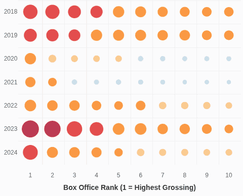

# Bollywood Box Office Champions: 30 Years of Cinema Success

## What is this?

This project creates a beautiful, interactive visualization that shows the biggest Bollywood hits from 1994 to 2024. Think of it as a visual journey through three decades of Hindi cinema's most successful films at the box office.



## What you'll see

The visualization displays:

- **Circles representing movies**: Each circle is a film, with bigger circles meaning higher box office earnings
- **Colors showing earning ranges**: From blue (lower earnings) to red (massive blockbusters)
- **Interactive features**: Hover over any circle to see movie details, click to visit its Wikipedia page
- **Inflation adjustment**: Toggle to see what historical earnings would be worth in today's money

## Key insights revealed

- **Dangal (2016)** holds the record with ₹2,160 crores worldwide
- The **2013-2016 period** was particularly golden for Bollywood blockbusters
- **Franchise films** (sequels) dominate the highest earning spots
- Box office numbers have grown dramatically over the decades
- Recent hits like **Jawan** and **Stree 2** show strong post-pandemic recovery

## How the data was gathered

The movie data comes from **Wikipedia**, specifically from pages listing:

- Highest-grossing Bollywood films by year
- Worldwide box office collections in Indian Rupees (crores)
- Only Hindi-language films are included
- Top 10 films per year from 1994-2024

The **inflation data** comes from official Indian consumer price index statistics, allowing us to convert historical earnings to 2024 purchasing power for fair comparison across decades.

## How it was built

This is a **web-based visualization** built with:

- **HTML/CSS**: For the webpage structure and styling
- **D3.js**: A powerful JavaScript library for creating interactive data visualizations
- **Responsive design**: Works on different screen sizes

The code was written following modern web development practices:

- Clean, readable JavaScript
- Interactive features with smooth animations
- Mobile-friendly responsive layout
- Accessible color schemes for better visibility

## Files in this directory

- `index.html` - The main webpage that displays everything
- `script.js` - The JavaScript code that creates the interactive chart
- `highest_grossing.csv` - The movie data (year, rank, title, box office earnings)
- `inflation.csv` - Indian inflation rates by year for price adjustments
- `screenshot.webp` - Image showing what the final visualization looks like
- `README.md` - This explanation file

## How to view it

1. **Simple way**: Open `index.html` in any modern web browser
2. **Better way**: Use a local web server (prevents security restrictions):
   ```bash
   python3 -m http.server 8000
   ```
   Then visit `http://localhost:8000` in your browser

## What makes this special

- **Three decades of data**: Comprehensive coverage from 1994 to 2024
- **Fair comparisons**: Inflation adjustment lets you compare earnings across different eras
- **Beautiful design**: Award-worthy visual presentation with storytelling narrative
- **Interactive exploration**: Click, hover, and toggle to discover insights
- **Educational**: Learn about Bollywood's evolution and box office trends

This visualization tells the story of how Bollywood has evolved, from family dramas of the 90s to action spectacles of today, reflecting changing audience tastes and India's growing economy.

## Prompts

This data visualization was vibe coded using:

- [Codex CLI](https://developers.openai.com/codex/cli/) to create the [scraper](./scrape.py). [Conversation](./prompts/scraper.md)
- [Claude Code](https://claude.com/product/claude-code) to create the [visualization](./script.js). [Conversation](./prompts/dataviz.md)
