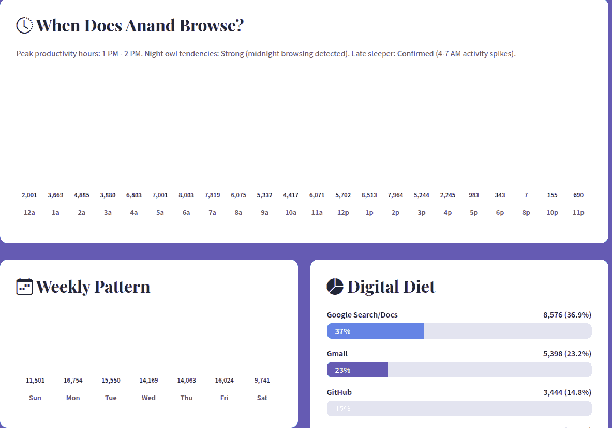

# Browser History Data Visualization

I vibe-coded data visualizations of my browser history over the last 4 months.

## Planning

**STEP 1**: Ran `codex --search` with GPT-5-codex (high) to create an ideation [plan.md](./plan.md)

<!-- /home/sanand/.codex/sessions/2025/10/04/rollout-2025-10-04T10-05-46-0199acf7-d379-7fb2-b271-37a0911eadcc.jsonl -->

> Suggest interesting analyses & visual storytelling ideas based on my browser history that I can publish as journalistic data stories on my blog.
>
> Use my Edge/Ubuntu browser history at ~/.config/microsoft-edge/Default/History - a SQLite database. (Open it as read-only with no lock.)
>
> Search online for more creative ideas.
>
> Evaluate each based on analysis novelty, visual impact, usefulness for the reader, and reliability/robustness of the analysis.
>
> Save as plan.md.


**STEP 2**: Ran the same with `codex--search` with GPT-5 (high) to create an ideation [plan-b.md](./plan-b.md)

<!-- /home/sanand/.codex/sessions/2025/10/04/rollout-2025-10-04T10-07-19-0199acf9-3d13-7161-9530-14b25677d529.jsonl -->

⭐ I like GPT-5's ideation over GPT-5-Codex's ideation.

**STEP 3**: Continued the thread with GPT-5 asking it to merge the plans into [plan-spec.md](./plan-spec.md).

<!-- /home/sanand/.codex/sessions/2025/10/04/rollout-2025-10-04T10-44-12-0199ad1b-00a5-7651-b2c1-64e3a9cc941f.jsonl -->

> Read plan.md. Merge ideas from there and write a revised story idea list in plan-spec.md.
> Re-evaluate the idea list on the same criteria.
> Pick the top 3 ideas.
> For the top 3, create a concise prompt for Claude Code to generate the visual story.
> Include the SQL query and analysis steps.
> Do not explain what visual to create or how. Claude Code has a better visual aesthetic and can decide its course.
> Instead, explain the effect we want the analysis and visual to have on the audience; the mood / feeling to evoke.

**STEP 4**: Reviewed [plan-spec.md](./plan-spec.md). I like the goals.

- Goal: Reveal how much of daily work routes through AI assistants versus traditional resources, and how AI time interleaves with building and research.
- Goal: Surface the longest, most absorbing browsing episodes and how they branch from a single seed into deep research/build flows.
- Goal: Reveal the daily rhythm of attention—when focus concentrates and when it ebbs across weekdays vs weekends.

... but would rather have Codex do only the analysis and Claude Code do only the visualization. So I moved [plan-spec.md](./plan-spec.md) to /tmp (temporarily) and ...

**STEP 5**: Re-merge into [plan-spec.md](./plan-spec.md) and create story-wise specs using `codex --search` with GPT-5 (high)

<!-- /home/sanand/.codex/sessions/2025/10/04/rollout-2025-10-04T10-47-22-0199ad1d-e816-72f1-b320-18daba0c3868.jsonl -->

> Write prompts for interesting journalistic visual data stories from my browser history for my blog.
>
> Based on my Edge/Ubuntu browser history at ~/.config/microsoft-edge/Default/History - a SQLite database (open it as read-only with no lock)
> we have ideas in plan.md and plan-b.md. Merge ideas and write a revised story idea list in plan-spec.md.
>
> Evaluate each based on analysis novelty, visual impact, usefulness for the reader, and reliability/robustness of the analysis.
> Pick the top 3 ideas.
>
> For each of these top 3 ideas:
> - Create a folder named concisely (2-3 words) based on the story. Use lowercase-hyphenated names.
> - In each folder, create a concise prompt for Claude Code to generate the visual story in `${folder}/spec.md`.
>   Do not explain what visual to create or how. Claude Code has a better visual aesthetic and can decide its course.
>   Instead, explain the effect we want the analysis and visual to have on the audience; the mood / feeling to evoke.
>   Explain how Claude Code can re-do the analysis or get any additional context.
> - Run the analyses required to generate the story and save them as .csv files under the folder.
>   It is better to provide more information for context than just the summaries.
>   So include any additional fields/rows that may help write a better story.
>   Mention what each file contains and how it was generated in spec.md.

## Attention Clock

**STEP 5**: Ran `npx -y @anthropic-ai/claude-code --permission-mode acceptEdits` in `attention-clock/`.

<!-- /home/sanand/.claude/projects/-home-sanand-code-datastories-browser-history-attention-clock/8d1c11c0-cde2-499a-8190-2711c9b2afb6.jsonl -->

> Create a beautiful award winning data journalistic visualization on my browsing history as per [spec.md](./attention-clock/spec.md).

It created [attention-clock](./attention-clock/index.html) which was beautiful but not too insightful.

[](./attention-clock/index.html)

## Digital Life

**STEP 6**: Asked Claude Code to generate a full story by itself.

<!-- /home/sanand/.claude/projects/-home-sanand-code-datastories-browser-history-claude/f1ec0d72-3ff1-4cce-a96e-98017164402a.jsonl -->

I copied the history into `history.db` and ran `npx -y @anthropic-ai/claude-code --permission-mode acceptEdits` in `history/` with:

> Create a beautiful award winning data journalistic visualization on Anand's browsing history.
>
> Use this copy of Edge's SQLite `history.db`.
>
> Be insightful, funny/witty, gently instructive.

It generated a version which looked OK but had this problem:



> See screenshot1.webp. Two charts are empty. Fix these.

That was OK, not too impressive either.

[](./digital-life/index.html)

## Rabbit Holes

**STEP 7**: Ran `npx -y @anthropic-ai/claude-code --permission-mode acceptEdits` in `rabbit-holes/` with a revised version of [spec.md](./rabbit-holes/spec.md) using a local copy of the history.

<!-- /home/sanand/.claude/projects/-home-sanand-code-datastories-browser-history-rabbit-holes/75671a94-d56b-4549-aa40-270c361760ad.jsonl -->

> Create a beautiful award winning data journalistic visualization on Anand's browsing history.
> Focus on how a single spark becomes a journey.
> Make readers feel the momentum of a rabbit hole — curiosity tightening into flow — and the tenderness of losing it.
> Celebrate deep dives, avoid shaming detours.
>
> Effect/mood to evoke
> - Momentum: chains that gather force and coherence.
> - Texture: some journeys are tight spirals, others are branching explorations.
> - Reflection: name the themes without reducing them to productivity.
>
> Analysis hints:
> - Prefer Edge’s on-device “Journeys” clusters (`clusters`, `clusters_and_visits`) when populated; otherwise fall back to pure graph walks over `visits.from_visit`.
> - Re-run SQL on a read-only copy of `history.db`.
> - Foreground time from `context_annotations.total_foreground_duration` (µs). Time bounds via min/max timestamps per journey/chain.
>
> Some existing CSVs for reference:
> - chains_summary.csv — one row per root `from_visit` chain with visit_count, distinct_domains, start/end timestamps (UTC), duration_sec, total_foreground_sec; built via a recursive CTE that walks `from_visit` from roots.
> - chain_depths.csv — per chain, maximum depth (longest branch) and total_nodes; useful to pick the most “rabbit‑hole‑ish” journeys.
> - If `clusters*` tables are non-empty, you can also compute the cluster-level summaries (`clusters_summary.csv`, `cluster_depths.csv`).

While working, it said something I quite liked:

> The visualization will use a **particle flow system** where each chain is a flowing stream of particles, showing momentum building as curiosity deepens.

It created `rabbit-holes/index.html` which was beautiful! But I needed more details.

**STEP 7**: I really liked what it created, so I continued the session, asking it to expand.

> I love the design and style of this! But this does not give me any specifics about any of these:
> the spirals, the branching explorations, etc. like what sites I visited, what the chain was about,
> or even what the branching structure looked like.
>
> Expand the story to provide specifics. Be insightful and instructive.

**STEP 8**: This was beautiful, so I took a [backup of this version](./rabbit-holes/v2.html) and had it tweak:

> Fantastic! Hyperlink all pages.
> Begin with the patterns of exploration.
> Then, for each pattern, show two interesting examples.
> The current examples are perfect. Add more as required. Pick the most interesting ones.

Then:

> Avoid localhost examples

Then:

> Ensure that the three patterns of exploration fit in a single row.
> Ensure that each category begins with a public site example, i.e. not a site that requires a login or that the audience cannot access.

The [result](./rabbit-holes/index.html) is _beautiful_!

[](./rabbit-holes/index.html)

## Search Funnels

**STEP 9**: Same approach. Ran `npx -y @anthropic-ai/claude-code --permission-mode acceptEdits` in `search-funnels/` with a revised version of [spec.md](search-funnels/spec.md) using a local copy of the history.

<!-- /home/sanand/.claude/projects/-home-sanand-code-datastories-browser-history-search-funnels/d550130c-0aa9-4faf-bc5e-067547524e8c.jsonl -->

> Create a beautiful award winning data journalistic visualization on Anand's browsing history.
> Reveal whether questions actually find answers.
> Make the journey from a search to its first destination feel tangible — hopeful when swift, curious when meandering.
> Focus on empathy: everyone googles in loops; clarity comes from seeing the loops.
>
> Effect/mood to evoke
> - Curiosity resolved: quick funnels feel like a small win.
> - Discovery vs. dithering: some terms scatter to many sites; others converge.
> - Practicality: readers pick up how to craft searches that land.
>
> Analysis hints:
> - Re-run SQLite on `history.db`.
> - Identify search visits via `keyword_search_terms` and find first click-throughs using `visits.from_visit`.
> - Compute `time_to_click_sec` as `(dest.visit_time - search.visit_time)/1e6` and aggregate by `normalized_term`.
>
> Some existing CSVs for reference:
> - search_funnels_terms.csv — per normalized search term: search_events, clicks, click_rate, avg_time_to_click_sec, unique_dest_domains, top_dest_domain (+ clicks/share), total_dest_foreground_sec.
> - search_destinations.csv — for each term × destination domain: clicks, avg_time_to_click_sec, total_dest_foreground_sec.
> - search_samples.csv — sample term → destination titles with timestamps (anonymize as needed in publication).

[Version 1](./search-funnels/v1.html) was nice. So I added:

> Nice!
> In the search journeys, highlight the most interesting individual (search, time-to-click) items and add a sentence explaining these. Allow filtering by these (apart )
> Allow sorting by time, clicks, searches, destinations, and restoring to the original order.
> For each journey type, synthesize and share insights based on the patterns you see.
> Add links to search queries (e.g. google.com/search?q=...).
> Replace the Rhythm of Search visual with a more insightful, visually appealing one.

[Version 2](./search-funnels/v2.html) could be improved a bit:

> Great!
>
> Drop the "Where Do Searches Lead" section
> For the "Interesting" searches, hand-craft the explanation for each. Unique, insightful, leading up to a collective story.
> Improve the "What Each Journey Type Reveals" section. Rewrite with big, useful, non-obvious/surprising insights.
>
> Modify "The Search Landscape" into a scatterplot that fills the width of the window, where:
>   - x = Number of searches
>   - y = Number of destinations
>   - Size = Number of searches at that (x,y) intersection
>   - Color = Average time to click (divergent scale)
>
> Rewrite the "Reading the Landscape" chart to explain the chart AND share with big, useful, non-obvious/surprising insights.

This led to a squashed chart. So....


> The search landscape chart is squeezed into the left. See screenshot-landscape.webp

[Version 3](./search-funnels/v3.html) didn't have much insight on the search landscape. So:

> Delete "The Search Landscape" and "Reading the Landscape" sections.

[](./search-funnels/index.html)

## Scrub

To review for privacy issues, I asked `codex` with GPT-5 (high) to create [leaks.md](./leaks.md):

<!-- /home/sanand/.codex/sessions/2025/10/04/rollout-2025-10-04T13-02-18-0199ad99-6fb1-7fa3-a412-6533741a9f71.jsonl -->

> Review files added for commit and identify privacy issues / data leaks.
> For each file, mention a list of issues (if any) along with severity.
> Provide enough information for the reader to decide whether to publish or not.
> Save this in browser-history/leaks.md.

After reviewing, I went to the `search-funnels` folder and, in a new session of `codex` with GPT-5 (high) to:

<!-- /home/sanand/.codex/sessions/2025/10/04/rollout-2025-10-04T13-35-23-0199adb7-bb94-75f1-8a5e-39b64c2fd505.jsonl -->

> Go through v1.html, v2.html, v3.html and index.html.
> Find out which terms would be loaded from search_funnels_terms.csv based on the code's functionality.
> Filter the file so that only those terms remain and delete the rest.
> Ensure that this does not break any functionality.

That went too aggressive, so:

<!-- /home/sanand/.codex/sessions/2025/10/04/rollout-2025-10-04T13-45-42-0199adc1-2e7e-7432-84f3-14cc681aa75b.jsonl -->

> Go through index.html.
> Find out which terms would be loaded from search_funnels_terms.csv based on the code's functionality.
> Ensure that every filter (instant, quick, ...) and every sort order will have at least 20 results.
> Ensure that all interesting terms (e.g. those mentioned in the story) are included.
> Delete the rest from search_funnels_terms.csv.

## Browsing patterns

I continued exploring [rabbit holes](#rabbit-holes) with this prompt.

> Create a beautiful award winning data journalistic visualization on Anand's browsing history as a single page web app.
>
> Write about the following three patterns of browsing: Linear Spirals, Hub & Spoke, Wide Survey.
>
> - Skip localhost sites.
> - Categorize browsing chains into these buckets (or "Other").
> - Find out how many belong in each category.
> - Explore interesting chains and write 3 mini-stories about the most interesting ones in each category for a lay audience.
>   - If the most interesting ones are private sites (requiring login, e.g. banks, email, etc.) pick no more than 1 such story per category.
> - Always include links to public pages. Never include links to private pages (i.e. that requires login, e.g. banks, email, etc.)
>
> ```
> Linear Spirals: One page → next → next. Deep focus, single thread. Branching ≈ 1.0
> Root
> └─ A
>    └─ B
>      └─ C
>        └─ D
>          └─ E
>            └─ F
>
> Hub & Spoke: Return to index, open new tab. Configuration work. Branching 2-6×
> Root
> ├─ A
> ├─ B
> │  ├─ B1
> │  └─ B2
> ├─ C
> └─ D
>
> Wide Survey: Many tabs from root. Cataloging, surveying. Branching 10-24×
> Root
> ├─ A
> ├─ B
> ├─ C
> ├─ D
> ├─ E
> ├─ ...
> ```
>
> Analysis: Run SQL on `history.db`. Use these queries as hints:
>
> ```sql
> -- chain_summary
> WITH recursive edges AS
> (
>           SELECT    v.id AS visit_id,
>                     v.from_visit,
>                     datetime((v.visit_time/1000000)-11644473600,'unixepoch')          AS ts_utc,
>                     COALESCE(c.total_foreground_duration, v.visit_duration)/1000000.0 AS fg_sec,
>                     (v.transition & 255)                                              AS base_t,
>                     u.url,
>                     u.title,
>                     CASE
>                               WHEN u.url LIKE 'http%' THEN substr(u.url, instr(u.url,'://')+3,
>                                         CASE instr(substr(u.url, instr(u.url,'://')+3),'/')
>                                                   WHEN 0 THEN length(u.url)
>                                                   ELSE instr(substr(u.url, instr(u.url,'://')+3),'/')-1
>                                         END)
>                               ELSE u.url
>                     END AS host
>           FROM      visits v
>           LEFT JOIN context_annotations c
>           ON        c.visit_id=v.id
>           JOIN      urls u
>           ON        u.id=v.url
>           WHERE     (
>                               v.transition & 255) NOT IN (3,4) ), roots AS
> (
>           SELECT    e.visit_id
>           FROM      edges e
>           LEFT JOIN edges p
>           ON        e.from_visit=p.visit_id
>           WHERE     e.from_visit IS NULL
>           OR        p.visit_id IS NULL), walk(root_id, visit_id, from_visit, ts_utc, fg_sec, host, title, depth) AS
> (
>        SELECT r.visit_id AS root_id,
>               e.visit_id,
>               e.from_visit,
>               e.ts_utc,
>               e.fg_sec,
>               e.host,
>               e.title,
>               1
>        FROM   roots r
>        JOIN   edges e
>        ON     e.visit_id = r.visit_id
>        UNION ALL
>        SELECT w.root_id,
>               e.visit_id,
>               e.from_visit,
>               e.ts_utc,
>               e.fg_sec,
>               e.host,
>               e.title,
>               w.depth+1
>        FROM   edges e
>        JOIN   walk w
>        ON     e.from_visit = w.visit_id)
> SELECT   root_id                                                                  AS chain_id,
>          count(*)                                                                 AS visit_count,
>          count(DISTINCT host)                                                     AS distinct_domains,
>          min(ts_utc)                                                              AS start_ts_utc,
>          max(ts_utc)                                                              AS end_ts_utc,
>          cast((julianday(max(ts_utc))-julianday(min(ts_utc)))*86400.0 AS integer) AS duration_sec,
>          round(sum(
>          CASE
>                   WHEN fg_sec>0 THEN fg_sec
>                   ELSE 0
>          END),2) AS total_foreground_sec
> FROM     walk
> GROUP BY root_id
> HAVING   visit_count >= 3
> ORDER BY visit_count DESC
>
>
> -- chain_depths.csv
> WITH recursive edges AS
> (
>        SELECT v.id AS visit_id,
>               v.from_visit
>        FROM   visits v
>        WHERE  (
>                      v.transition & 255) NOT IN (3,4)), roots AS
> (
>           SELECT    e.visit_id
>           FROM      edges e
>           LEFT JOIN edges p
>           ON        e.from_visit=p.visit_id
>           WHERE     e.from_visit IS NULL
>           OR        p.visit_id IS NULL), walk(root_id, visit_id, depth) AS
> (
>        SELECT r.visit_id,
>               r.visit_id,
>               1
>        FROM   roots r
>        UNION ALL
>        SELECT w.root_id,
>               e.visit_id,
>               w.depth+1
>        FROM   edges e
>        JOIN   walk w
>        ON     e.from_visit = w.visit_id)
> SELECT   root_id    AS chain_id,
>          max(depth) AS max_depth,
>          count(*)   AS total_nodes
> FROM     walk
> GROUP BY root_id
> ORDER BY max_depth DESC limit 5000;
> ```

But the stories were not very impressive (and also hard to anonymize). So, here are a few observations.

- Most of the chains are linear spirals. Wide surveys are rare:
  - 80%: Linear spirals
  - 16%: Hub and spoke
  - 2%: Wide surveys
- Here's another hub-and-spoke exploration: a Google image search for "llm as a judge accuracy", opening images
  - ... refining the search to "llm as a judge accuracy chart" and exploring images
  - ... refining the search to "llm as a judge accuracy vs humans" and exploring images
- Here's another wide survey: Opening individual pens from [my codepen](https://codepen.io/sanand0/)

## Learnings

- **Planning helps**. GPT-5 is a good planner and can analyze the data to suggest what will be more insightful.
- **Wandering helps**. I can't predict which story will click. Try them all. E.g. I didn't expect [`rabbit-holes/`](./rabbit-holes/index.html) would beat [`attention-clock/`](./attention-clock/index.html).
