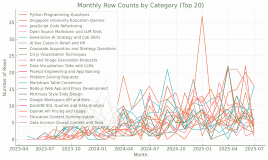
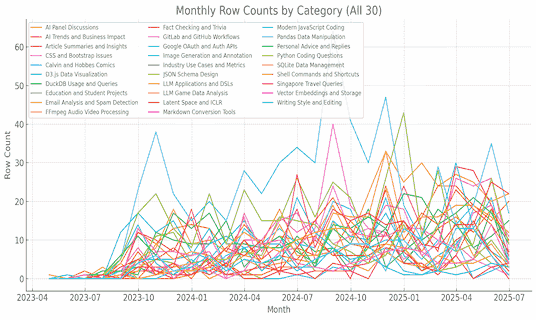
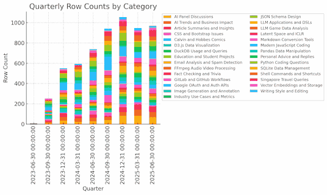
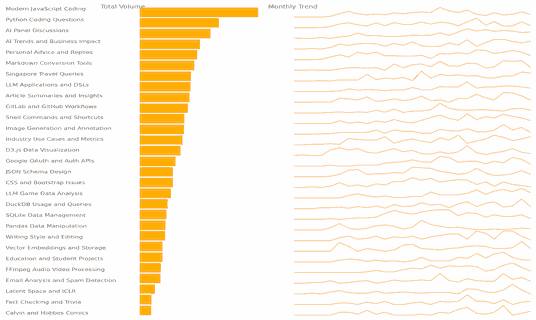
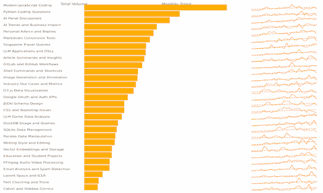
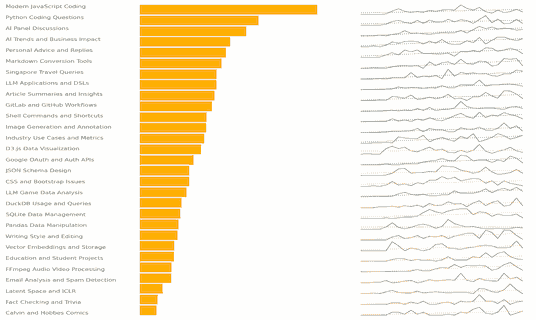
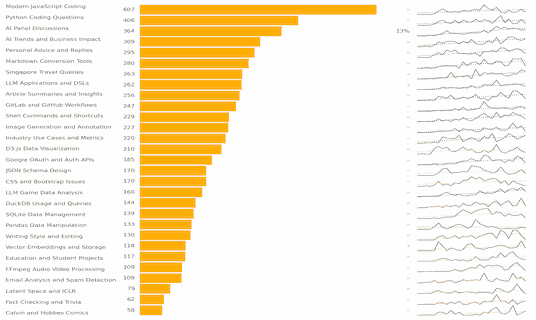
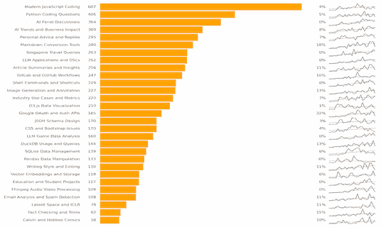
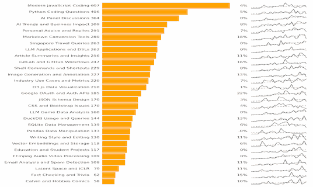

# ChatGPT Topic Trends

Here's how I use [ChatGPT](https://chatgpt.com/), based on the ~6,000 conversations I've had in 2 years. For each topic, I've listed the number of chats and the average month-on-month growth.

| Group    | Topic                             | Chat | Growth |
| -------- | --------------------------------- | ---: | -----: |
| Tech     | Modern JavaScript Coding          |  607 |   +0.9 |
| Tech     | Python Coding Questions           |  406 |   +0.6 |
| AI       | AI Panel Discussions              |  364 |   +1.1 |
| AI       | AI Trends and Business Impact     |  309 |   +0.7 |
| Personal | Personal Advice and Replies       |  295 |   +0.6 |
| Tech     | Markdown Conversion Tools         |  280 |   +0.8 |
| Personal | Singapore Travel Queries          |  263 |   +0.8 |
| AI       | LLM Applications and DSLs         |  262 |   +0.8 |
| Content  | Article Summaries and Insights    |  256 |   +0.6 |
| Tech     | GitLab and GitHub Workflows       |  247 |   +0.7 |
| Tech     | Shell Commands and Shortcuts      |  229 |   +0.7 |
| Other    | Image Generation and Annotation   |  227 |   +0.6 |
| AI       | Industry Use Cases and Metrics    |  220 |   +0.4 |
| Tech     | D3.js Data Visualization          |  210 |   +0.1 |
| Tech     | Google OAuth and Auth APIs        |  185 |   +0.5 |
| Tech     | JSON Schema Design                |  170 |   +0.2 |
| Tech     | CSS and Bootstrap Issues          |  170 |   +0.2 |
| AI       | LLM Game Data Analysis            |  160 |   +0.6 |
| Tech     | DuckDB Usage and Queries          |  144 |   +0.4 |
| Tech     | SQLite Data Management            |  139 |   +0.2 |
| Tech     | Pandas Data Manipulation          |  133 |   -0.0 |
| Content  | Writing Style and Editing         |  130 |   +0.3 |
| AI       | Vector Embeddings and Storage     |  118 |   +0.2 |
| Other    | Education and Student Projects    |  117 |   +0.4 |
| Tech     | FFmpeg Audio Video Processing     |  109 |   +0.4 |
| Other    | Email Analysis and Spam Detection |  108 |   +0.3 |
| AI       | Latent Space and ICLR             |   79 |   +0.2 |
| Other    | Fact Checking and Trivia          |   62 |   +0.2 |
| Other    | Calvin and Hobbes Comics          |   58 |   +0.1 |

My top use, by far, is for **technology**. "Modern JavaScript Coding" and "Python Coding Questions" are ~30% of my queries. There's a long list with Markdown, GitLab, GitHub, Shell, D3, Auth, JSON, CSS, DuckDB, SQLite, Pandas, FFMPeg, etc. featured prominently.

Next is to brainstorm **AI use**: "AI Panel Discussions", "AI Trends and Business Impact", "LLM Applications and DSLs", "Industry Use Cases and Metrics" are also fast growing categories. I brainstorm talk outlines, refine slide deck narratives, and plan business ideas.

Thirdly, I use it for **content** reading/writing. "Article Summaries and Insights", "Writing Style and Editing".

Lastly, for **personal advice**. "Personal Advice and Replies" and "Singapore Travel Queries" are in this bucket.

Then there are niches like **image generation** ("Image Generation and Annotation", "Calvin and Hobbes Comics"), **research** ("Fact Checking and Trivia"), **emails** ("Email Analysis and Spam Detection"), and **teaching** ("Education and Student Projects").

6,000 chats saved me perhaps 600 hours. ChatGPT's "given" me a month of life-time for $600 -- which I reinvested into teaching and tinkering.

Today, 70% of my prompts are code. In five years, that might drop as AI handles coding, and I tackle strategy and thinking. My prompt portfolio 𝗶𝘀𝗻'𝘁 𝗳𝘂𝘁𝘂𝗿𝗲-𝗽𝗿𝗼𝗼𝗳? Is yours?

There's no finance, music, or philosophy. My prompts mirror my 𝗯𝗹𝗶𝗻𝗱 𝘀𝗽𝗼𝘁𝘀. Should I force one prompt a week in a category I've never explored? Would you?

## Process

To re-create this:

1. [Export your chat history](https://help.openai.com/en/articles/7260999-how-do-i-export-my-chatgpt-history-and-data), wait 1-2 days for the email link, download the ZIP archive, and extract the `conversations.json` from it. My 6,000 chats were ~330 MB.
2. Run [questions.py](questions.py) using `python questions.py` or `uv run chatgpt-extract-questions.py`. This will load `conversations.json` from the current directory and save a `questions.txt` that has the date, conversation title, and the first user message truncated in the middle:

   ```
   2025-05-19	Daily Learning Surprise.  Every day at 6 am, search online and teach me something new that I will find interesting - knowing my interests. Surprise me. Write it in a format suitable for listening via ...Write it as a friendly, engaging narrative suitable for listening via audio (no bullets, no tables).
   2025-06-17	UAPA Bail Hearing Patterns.  Write a concise version of the quesrion here.  Question is, we need to have a data set like this, it should have a triangular padding on one side the accused name, right? ...hey will gradually keep on postponing. Some reason or the other. And they will keep on denying bail.
   2025-06-17	Missing Header Value Debug.  My code works on one person's machine but the SAME code fails as follows on another's machine. Help us debug.  ces>python ocr.py Traceback (most recent call last):   File ...utheader     if _is_illegal_header_value(values[i]): TypeError: expected string or bytes-like object
   ```
3. Use [LLM Foundry Classify](https://llmfoundry.straive.com/classify) (currently not public) to create topic models. This automatically assigns clusters the questions into topics and names them.
4. [Talk to ChatGPT](https://chatgpt.com/share/68584291-a9bc-800c-a652-bc0702b1cdce) to visualize the trends.

Here are the prompts used in the conversation.

> Rename column A to "date" and "b" to "chat". Drop the 3rd column "Topic". Create a new column "category" that has the column name with the highest value in each row. Let me download the resulting CSV with columns date, chat, category. Then, draw a monthly time-series of the number of rows each month in each category. Make it beautiful. Include legends for the top 20 categories.



> Analyse the top 30 categories by volume and identify which ones are trending up the most and whine ones are trending down the most.

> Redo the same analysis with this dataset. It only has 30 categories. Show me the plot as well as the top movers.



> Plot quarter by quarter as a stacked bar.



> Create a chart showing each category in a row. To its right, add a horizontal bar based on the overall volume, and to its right a sparkline of its monthly trend. Vertically left-align the horizontal bars and the sparklines.



> Make the monthly trend width about 1/4th of its current width. Add a regression slope line to it in a different color.



> Color the regression lines with negative growth as red dotted lines. Regression lines with low growth as yellow dotted lines. Regression lines with high growth as green dotted lines. Draw the sparklines as grey lines. Drop the column headers "Total Volume" and "Monthly Trend". Reduce the width of the horizontal bar to 50% of the current width.



> Reduce the width of the sparklines further by half.
> To the left of the horizontal bars show the # of rows, formatted with a , separator, right aligned.
> To the left of the sparkline, show the regression slope as a CAGR, formatted as a % to 0 decimals, right aligned.



> Ensure that the category is vertically aligned with the row counts. Currently, it's a bit above.
> The CAGR is "-" in most cases. Ensure that we DO have the CAGR, handling the NaNs properly.


> The dotted line is no longer the best fit line any more. Is it still the regression line? If not, ensure that it is. Alongside it, show the regression slope represented as a CAGR.



> Make the width of the horizontal bars 1/3rd of the current width. Reduce the width of the sparklines as well a but. This effectively reduces the overall width of the chart considerably, making it much taller.



> The regression slope percentages shown as CAGRs don't look correct. Replace it with the regression slope to 1 decimal formatted as "+0.0" or "-0.0"


