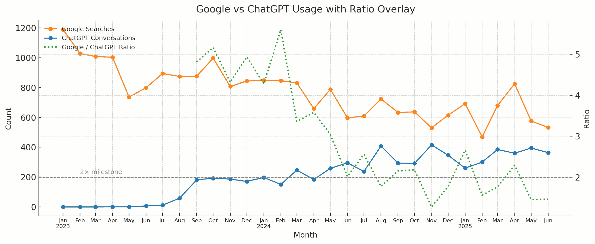
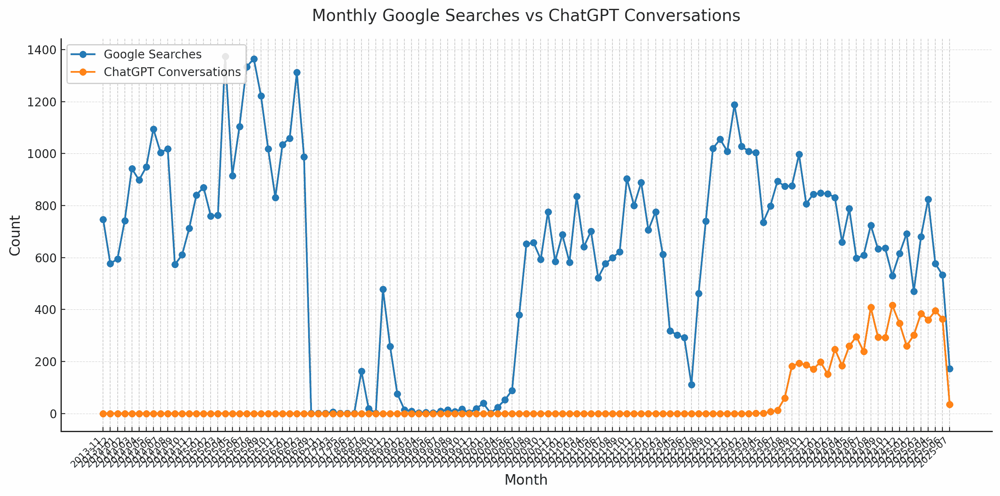
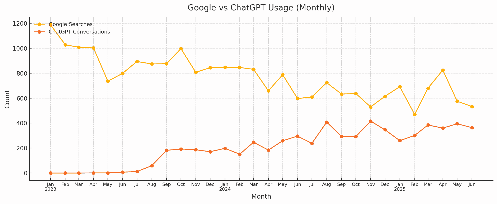

# My ChatGPT vs Google Usage

I started using ChatGPT actively in June 2023, when preparing for a talk about LLMs.

From Sep 2023 - Feb 2024, my Google usage was 5x ChatGPT. Then, fell to 3x until May 2024. Then about 2x until Apr 2025. Since May 2025, it sits at the 1.5x mark.



I engage with a ChatGPT conversation _much_ more than a Google search result. So clearly, ChatGPT became my top app beating Google some months ago. This seems to a global trend. ChatGPT gets 2.5B requests/day. Google gets 14B, which is 5-6 times larger. But I spend 5x more time on a ChatGPT conversation than a Google search. Google would rightly be worried.

This usage isn't complementary. The negative correlation of -0.74 is a strong substitution signal. I'm using ChatGPT _instead_ of Google, not _in addition_ to Google.

But let's look chat vs search instead of ChatGPT vs Google. What will people _search_ for instead of _chat_? Will search become just background data for LLMs? Should search engines optimize output for chatbots?

That might be a good thing for information diversity. I'm glad ChatGPT helps me ask fresh questions. Authors might be glad that different kinds of content will find an audience.

My chat will overtake search in 12-18 months. When ChatGPT becomes my primary lens on knowledge, "Who curates the lens? And who audits the curvature?" (to quote ChatGPT)

---

## Export Data

To extract Google Search data, go to [Google Takeout](https://takeout.google.com/) and export "My Activity". You'll be emailed a .zip file. Pull out `Takeout/My Activity/Search/MyActivity.json`.

To extract [ChatGPT](https://chatgpt.com/) data, go to Settings > Data controls > Export data and export your data. You'll be emailed a .zip file. Pull out `conversations.json`.

## Naive Analysis

I uploaded the above files, zipped, and asked [ChatGPT](https://chatgpt.com/share/68818b4e-ef2c-800c-bdb5-e4c25e4aaa81) to analyze them.

> MyActivity.json.xz has my Google Search activity. It's an array that looks like this:
>
> ```json
> [{
>   "header": "Search",
>   "title": "Visited How to Export Google Search History - Stack Overflow",
>   "titleUrl": "https://www.google.com/url?q\u003dhttps://stackoverflow.com/questions/38602730/how-to-export-google-search-history\u0026usg\u003dAOvVaw3LegTSrQ6IPvT2r66m7W1q",
>   "time": "2025-07-21T10:47:19.960Z",
>   "products": ["Search"],
>   "activityControls": ["Web \u0026 App Activity"]
> }, ...]
> ```
>
> From this, filter all objects where title begins with "Searched for" and count the number of instances per month.
>
> conversations.json.xz has my ChatGPT conversations. It's an array that looks like this:
>
> ```json
> [
>   {
>     "title": "Vipassana Comic Creation",
>     "create_time": 1752559406.539423,
>     "update_time": 1752574461.947834,
>     ...}]
> ```
>
> Use `create_time` and count the number of objects per month.
>
> Then, generate this as a CSV file that I can download. Use 3 columns: Month, Google Searches, and ChatGPT Conversations.
>
> Then, plot this as a beautiful line graph. Think about all visual elements that go into a well-designed and thoughtful line graph, including well-placed labels, typography, color palette, whitespace, axes and grid line design, legend placement, etc.

It errored out with a strange stammering.

> It seems the file might be too large, causing the process to time out after 300 seconds. One option
>
> It seems that the connection is getting closed, possibly
>
> It seems
>
> The connection appears to close because the file may be too
>
> The connection might be timing out due
>
> It looks like the file size might
>
> The connection might be closing because
>
> It seems like the connection is being closed, possibly because a large file is causing the process to take over
>
> It seems the connection keeps closing, possibly because the large file exceeds the 300-second limit. To avoid
>
> It seems the file's size combined with memory constraints is causing issues,
>
> ...

It was time for a different approach: extract and pass only the relevant stuff.

## Extract Usage

I asked [ChatGPT](https://chatgpt.com/share/68818a5b-f7b4-800c-87eb-898a71b31812):

> MyActivity.json.xz has my Google Search activity. It's an array that looks like this:
>
> ...
>
> Write a jq command to filter all objects where title begins with "Searched for" and count the number of instances per month, formatted as yyyy-mm

```bash
jq '
  [ .[]
    | select(.title | startswith("Searched for"))
    | .time[:7]
  ]
  | group_by(.)
  | map({ month: .[0], count: length })
' MyActivity.json
```

> conversations.json.xz has my ChatGPT conversations. It's an array that looks like this:
>
> ...
>
> Write a jq command to count the number of create_time instances per month as yyyy-mm

```bash
jq '
  [ .[]
    | .create_time
    | floor
    | gmtime
    | strftime("%Y-%m")
  ]
  | group_by(.)
  | map({ month: .[0], count: length })
' conversations.json
```

## Analyze Data

> These JSON files have my number of Google and ChatGPT uses per month. Merge them into a CSV file that I can download. Use 3 columns: Month, Google Searches, and ChatGPT Conversations. For any month I don't have any entries, set the value as zero.
>
> Then, plot this as a beautiful line graph. Think about all visual elements that go into a well-designed and thoughtful line graph, including well-placed labels, typography, color palette, whitespace, axes and grid line design, legend placement, etc.



https://chatgpt.com/share/68818b07-954c-800c-acbe-3bfb5220c272

> Show only data starting 2023. Drop 2025-07. Make sure the X-axis labels are clearly legible and don't overlap. Use Jan, Feb, Mar, etc and only label the years in Jan.



> Based on this data, what are the most insightful, non-obvious takeaways? List 3 actionable ones, 3 funny ones, and 3 thought-provoking ones.

**Actionable (do these now)**

1. **Redirect search budgets to LLM UX.** Google queries have collapsed 55 % since Jan ’23 while ChatGPT hits 0 → 0.78× Google by Nov ’24. Treat every FAQ, help‑desk, and tutorial as a chat workflow, not SEO copy.
2. **Capacity‑plan for ≥500 chats/month by Dec ’25.** Linear trend projects ChatGPT at ≈ 510 vs Google ≈ 440; concurrency, caching, and prompt‑cost controls need scaling.
3. **Track the “Chat‑over‑Search ratio” as a KPI.** Crossing 0.5 in Aug ’24 signalled behaviour shift months before volume parity—use 0.5 as an early‑warning trigger across other products.

---

**Funny (because numbers can joke)**

1. Google’s line is a ski‑slope; ChatGPT’s is a ski‑lift—apparently users prefer going _uphill_ chatting instead of _downhill_ Googling.
2. April ’23: ChatGPT spoke its first word (1 conversation). By Sep ’23 it’s a chatterbox (182). Terrible twos incoming.
3. If trends hold, 2026 could see ChatGPT asking itself for sources while Google sits in a rocking chair muttering “I’m Feeling Lucky … anyone?”

---

**Thought‑provoking (sleep‑on‑these)**

1. A ‑0.74 correlation hints at substitution, not complementarity. What happens to information diversity when one model mediates most queries?
2. Users hit ChatGPT \~300 × a month but still Google \~500 ×. Are we entering a dual‑brain era—LLM for reasoning, search for grounding?
3. Ratio momentum suggests chat will overtake search within 12–18 months. When conversational AI becomes the primary lens on knowledge, who curates the lens—and who audits the curvature?

> Also draw a chart of the Google / ChatGPT ratio and overlay it as a dotted line on this chart. Clearly indicate the milestone value of 2x. Drop values before 2023-09 (just for this ratio -- the rest of the graph stays)


