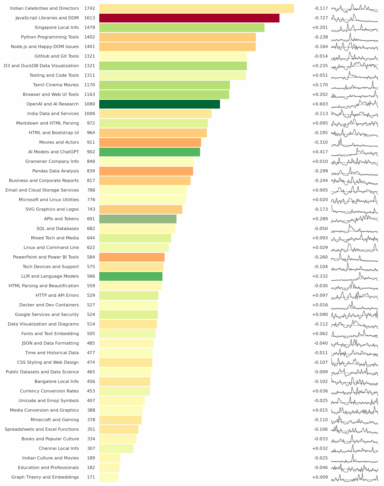

# Google Search Topic Trends

Here's how I use [Google Search](https://www.google.com/), based on my search history since Jan 2021. For each topic, I've listed the number of chats and the average month-on-month growth.

| Topic                            |  Count | Growth |
| -------------------------------- | -----: | -----: |
| Indian Celebrities and Directors | 1742.0 | -0.116 |
| JavaScript Libraries and DOM     | 1613.0 | -0.727 |
| Singapore Local Info             | 1479.0 |  0.200 |
| Python Programming Tools         | 1402.0 | -0.238 |
| Node.js and Happy-DOM Issues     | 1401.0 | -0.164 |
| GitHub and Git Tools             | 1321.0 | -0.013 |
| D3 and DuckDB Data Visualization | 1321.0 |  0.235 |
| Testing and Code Tools           | 1311.0 |  0.050 |
| Tamil Cinema Movies              | 1170.0 |  0.169 |
| Browser and Web UI Tools         | 1163.0 |  0.202 |
| OpenAI and AI Research           | 1080.0 |  0.603 |
| India Data and Services          | 1006.0 | -0.112 |
| Markdown and HTML Parsing        |  972.0 |  0.094 |
| HTML and Bootstrap UI            |  964.0 | -0.195 |
| Movies and Actors                |  911.0 | -0.309 |
| AI Models and ChatGPT            |  902.0 |  0.416 |
| Gramener Company Info            |  848.0 |  0.009 |
| Pandas Data Analysis             |  839.0 | -0.298 |
| Business and Corporate Reports   |  817.0 | -0.243 |
| Email and Cloud Storage Services |  786.0 |  0.004 |
| Microsoft and Linux Utilities    |  776.0 |  0.019 |
| SVG Graphics and Logos           |  743.0 | -0.172 |
| APIs and Tokens                  |  691.0 |  0.289 |
| SQL and Databases                |  682.0 | -0.049 |
| Mixed Tech and Media             |  644.0 |  0.092 |
| Linux and Command Line           |  622.0 |  0.029 |
| PowerPoint and Power BI Tools    |  584.0 | -0.260 |
| Tech Devices and Support         |  575.0 | -0.103 |
| LLM and Language Models          |  566.0 |  0.331 |
| HTML Parsing and Beautification  |  559.0 | -0.030 |
| HTTP and API Errors              |  529.0 |  0.096 |
| Docker and Dev Containers        |  527.0 |  0.015 |
| Google Services and Security     |  524.0 |  0.090 |
| Data Visualization and Diagrams  |  514.0 | -0.111 |
| Fonts and Text Embedding         |  505.0 |  0.062 |
| JSON and Data Formatting         |  485.0 | -0.039 |
| Time and Historical Data         |  477.0 | -0.010 |
| CSS Styling and Web Design       |  474.0 | -0.107 |
| Public Datasets and Data Science |  465.0 | -0.009 |
| Bangalore Local Info             |  456.0 | -0.102 |
| Currency Conversion Rates        |  453.0 |  0.036 |
| Unicode and Emoji Symbols        |  407.0 | -0.025 |
| Media Conversion and Graphics    |  388.0 |  0.015 |
| Minecraft and Gaming             |  378.0 | -0.110 |
| Spreadsheets and Excel Functions |  351.0 | -0.105 |
| Books and Popular Culture        |  334.0 | -0.033 |
| Chennai Local Info               |  307.0 |  0.031 |
| Indian Culture and Movies        |  189.0 | -0.024 |
| Education and Professionals      |  182.0 | -0.046 |
| Graph Theory and Embeddings      |  171.0 |  0.008 |



It didn't suprise me to see tech searches on top, but "Indian Celebrities and Directors" as #1 was a surprise. So was seeing [salman khan](https://www.google.com/search?q=salman+khan), [vijay antony](https://www.google.com/search?q=vijay+antony), and [vishal](https://www.google.com/search?q=vishal) as my most searched celebrities.

I did nudge ChatGPT to:

> Look closely at the numbers as well as the image.
> What insights can you draw from these? Aim for non-obvious non-trivial insights.
> Run correlations or any other analyses on the data to go deeper and come up with material suitable for a deep research paper.

What it shared was _really_ insightful and actionable. Here are excerpts:

- **AI research explodes fastest in absolute terms.**
  - Highest upward slope: **OpenAI & AI Research** +0.60 searches/month.
  - **LLM & Language Models** +0.33 searches/month
  - **APIs & Tokens** +0.29 searches/month
  - Confirms “AI gravity well” accelerating after ChatGPT’s release.
  - Suggests growing reliance on doc, spec, and token‑auth guidance (API quotas, scopes).
- **Outlier decline in _Movies & Actors_ (‑0.31) vs. upswing in _AI Models & ChatGPT_ (+0.42).** My entertainment queries were cannibalised by AI‑workflows interest. Spare leisure time is now redirected to AI tinkering. (I've almost entirely stopped watching movies.)
- **My search interests are diversifying.** The [HHI](https://en.wikipedia.org/wiki/Herfindahl%E2%80%93Hirschman_index) slope ≈ ‑1, indicating that curiosity is spreading over more niches. (Good to know!)

... but the really powerful (and actionable 💡) insights were:

- **[PCA](https://en.wikipedia.org/wiki/Principal_component_analysis) shows three ‘personas’.**
  - **32 %**: classical dev stack (JS DOM, HTML UI, Python Tools)
  - **24 %**: AI‑builder stack (OpenAI, LLMs, APIs & Tokens)
  - **16 %**: India/Singapore geo‑cultural info (Celebs, Local Info, Tamil Cinema).
  - 💡 Segment sharing & learning along these axes (e.g. separate newsletters or dashboards.)
- **Testing & Deployment topics sit at the [correlation](https://en.wikipedia.org/wiki/Correlation) crossroads.**
  - **Testing & Code Tools** correlates strongly with both dev stack and AI stack clusters (ρ>0.7). Serves as integration glue.
  - 💡 **Invest in test‑automation expertise** for outsized ROI. Improvement here amplifies throughput across all other areas.
- **Volatility is domain‑specific**. Based on [Coefficient of Variation](https://en.wikipedia.org/wiki/Coefficient_of_variation):
  - Highest CV: **SQL & Databases** (0.24), **Testing & Code Tools** (0.23).
  - Lowest CV: **Currency Conversion Rates** (0.05), **Singapore/Bangalore Local Info** (0.06).
  - Real‑time “fire‑fight” topics are episodic; stable reference needs are perennial.
  - 💡 Automation opportunity: cache common reference lookups locally; allocate “deep‑focus blocks” for debugging spikes.

I would _not_ have thought of these analyses possibilities!

## Process

To extract Google Search data, go to [Google Takeout](https://takeout.google.com/) and export "My Activity". You'll be emailed a .zip file. Pull out `Takeout/My Activity/Search/MyActivity.json` as `google.json`.

Extract all the search terms by extracting them from all lines with `"title": "Searched for ..."`:

```bash
grep 'Searched for' google.json | cut -c26- | sed 's/",$//' > google.txt
```

Run [topicmodel](https://pypi.org/project/topicmodel/) to identify topics:

```bash
export OPENAI_API_KEY=...
uvx topicmodel google.txt --ntopics 50 --nsamples 30 --output topics.txt
```

Merge `topics.txt` into `google.json` using [merge.py](merge.py):

```bash
uv run merge.py
```

[ChatGPT](https://chatgpt.com/share/6883b1eb-dc14-800c-8be8-87cb559e69e2) then creates the charts and analyses.
