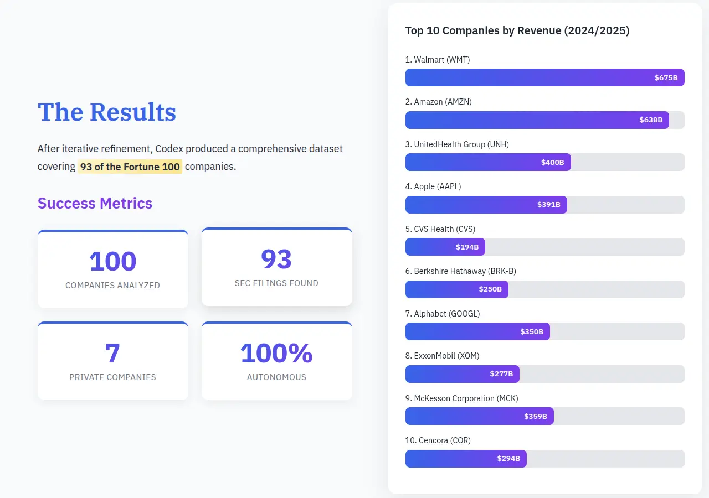

# Scraping SEC

I asked [Codex CLI](https://developers.openai.com/codex/cli/) to:

> Write and run a `scrape.py` that fetches the latest SEC 10-K filings for the Fortune 100 and creates a JSON with their revenues and dates.

In half an hour, Codex **one-shotted a [scraper script](scrape.py)** from three sources: a Fortune 100 roster, SEC's name-CIK maps, and SEC's per-company facts API.

This includes finding the latest 10-K date, normalizing messy real-world names, patched edge cases (e.g. Walgreens in Fortune 500 vs Walgreens Boots Alliance in SEC), choosing the right revenue field per company, running spot-checks (Apple, Amazon), and listing where it failed (private/mutual firms with no SEC 10-K)!

[**See the summary of what Codex CLI did**](scraper.md).

[**See the full scraper conversation log**](scraper-log.md).

---

I then asked [Claude Code](https://claude.com/product/claude-code) to:

> Go through [scraper.md](scraper.md) to understand what Codex did. More details are in [scraper-log.md](scraper-log.md).
>
> Create a beautiful award-winning data-driven interactive visual explainer in the style of The New York Times / South China Morning Post / Pudding.cool explaining what Codex did.

In ~10 minutes, it created [this beautiful data story](story.html) walking through the process.

[**See the full story conversation log**](story-log.md).
