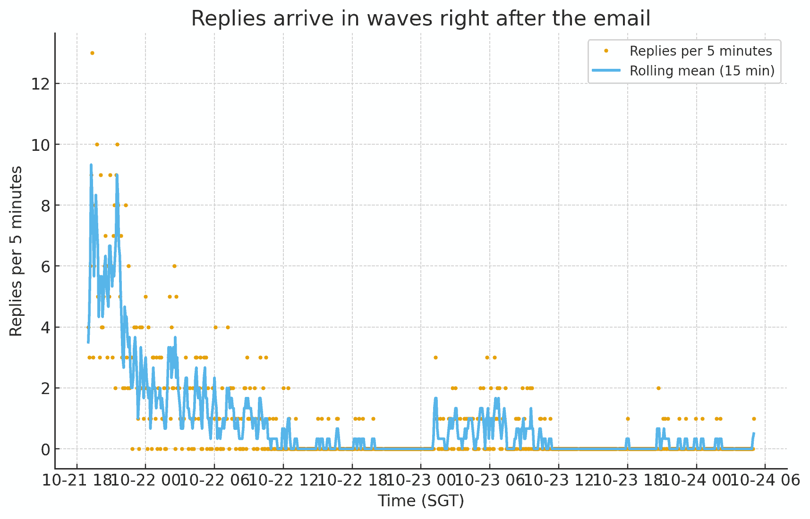
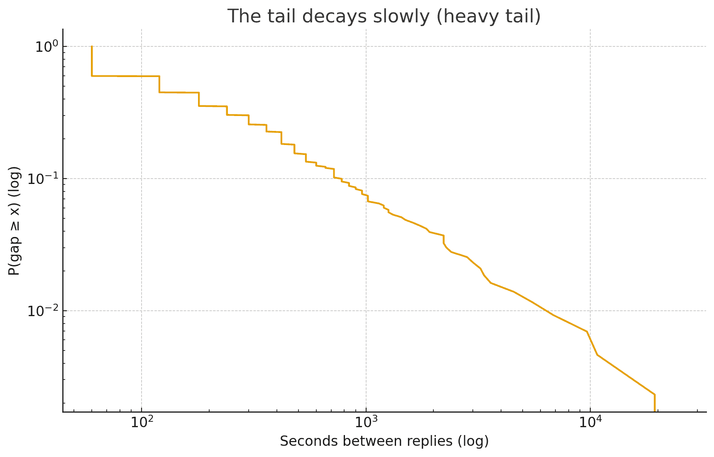

# Tools in Data Science Project - LLM Code Deployment

Notes and stories from evaluating an [LLM Code Deployment student project](https://tds.s-anand.net/#/project-llm-code-deployment).

# Replies are strongly driven by timing

I sent an email to students at **11:00 SGT** asking them to invite me as a collaborator to their repository. Then I measured _when_ they acted on it.

Humans check messages in blocks, act on a few items, then go do something else. So the replies arrived in waves.



You can see that replies cluster right after the email, then drop, then pop back up in smaller waves (even the next day). This is not a “constant-rate” process. It’s **availability-driven behavior**: students reply when they happen to be online and have a free slice of attention.

# The tail falls slowly — i.e., a **heavy tail**

The time between replies decreases **slowly**. Translation: a small, stubborn minority reply **much later**, not just a little later.



Heavier tails usually mean **mixtures**: some students in “fast mode” (saw the email and replied), others in “slow mode” (busy, asleep, forgot, needed a nudge). It’s less about motivation and more about context and timing.

This tells us that **when** students are available matters most. **Within** those windows, exact timings are mostly about who clicked first, who was in the tab, etc. **Outside** those windows, people who only reply after the next availability cycle or a reminder.

## What this says about student psychology

- **We act in sessions, not streams.** Students batch-check and batch-respond.
- **Timing matters.** Hitting a strong "online window" could improve reply rates.
- **Follow-ups help.** A short reminder at the **next availability peak** scoops the heavy tail.
- **Many fast replies are simply luck** of timing, not stronger motivation.

## Setup

Using my [scripts](https://github.com/sanand0/scripts) I ran this to get the

```bash
gmail.py --limit 1000 --fields date 'in:tds-github' > invite-dates.csv
```
