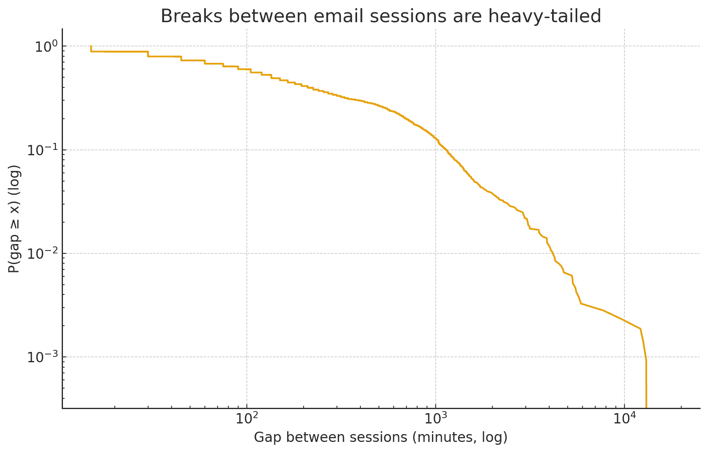

# When I send emails / replies

I wanted to understand my email reply / sending pattern, normalizing for mass mails or mail-merges.

Using my [Sent email timings](sent.csv), I treated every 15-minute slot as “active” if I sent at least one email in that slot, and 0 otherwise. This way, a mail-merge of hundreds still counts as **one** active slot.

## My email life has a **body clock**

If you look across all days and ask, “What’s the chance I sent any email in this 15-minute slot?”, the pattern is unmistakable: mornings warm up; afternoons hit a stride; evenings taper; nights are quiet. That’s a classic **circadian rhythm** in my email habit.

## Weekdays are for email… weekends, less so

No surprise, but it’s nice to see it quantified: the probability that I send an email in a given 15-minute slot is far higher Monday–Friday than Saturday–Sunday.

## I work in **sessions**, not one-offs

When I do email, I tend to keep doing email for a while. Below is the distribution of **session lengths**, where a session is one or more consecutive active 15-minute bins. The typical session is short, but there are plenty of medium sessions—and a long tail of deep email dives.

## The breaks between sessions can be long

How long until the _next_ email session? The “gap” has a heavy tail—lots of short breaks, and a few very long ones. That’s how human time works: we batch work, then life interrupts.

## What this means when you mail me

- **Main in my active window.** Replies will be faster
- **Make my work easy**. Tasks over 30+ min spills out of the email session and get dropped
- **Remind during active window.** Nudging on the **next** active window is most effective.

## Analysis

[ChatGPT](https://chatgpt.com/share/68fb0021-54ec-800c-b1d0-979cd9fe670d)
