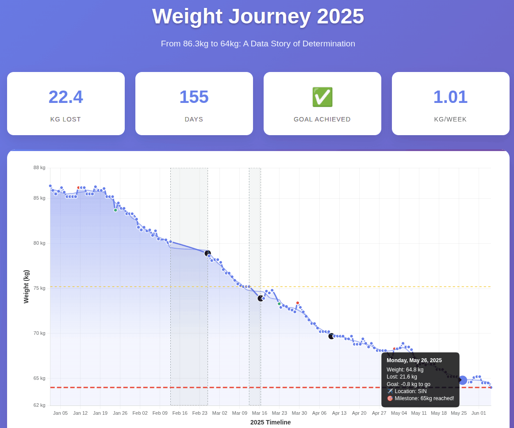

# Weight Journey 2025: From 86.3kg to 64kg

An interactive data visualization telling the story of a successful weight loss journey in 2025.



## Summary

I lost 22 kg in 22 weeks.

**How?** Skipped lunch, no snacks. (That's all.)

**Why?** Cholesterol.

**When?** Since 1 Jan 2025. I plan to continue.

**How far?** At 64 kg, I'm at 22 BMI. I'll aim for 60 kg.

**Is fasting 12 hours OK?** [Ankor Rai](https://www.linkedin.com/in/ankorrai/) shared [Mindy Pelz](https://drmindypelz.com/)'s [chart](https://www.reddit.com/r/fasting/comments/gli80l/dr_mindy_pelz_on_youtube_has_been_a_huge_source/) that fasting benefits truly kick in after 36 hours. Long way to go.

**No exercise?** Exercise is great for fitness & happiness. Not weight loss. Read [The Hacker's Diet](https://en.wikipedia.org/wiki/The_Hacker%27s_Diet) by [John Walker](<https://en.wikipedia.org/wiki/John_Walker_(programmer)>).

**No LLMs stuff this post?** Of course! I vibe coded the data extraction, analysis and visualization with [Claude Code](https://docs.anthropic.com/en/docs/claude-code/overview) for my [VizChitra](https://vizchitra.com/#speakers) talk.

Data viz: https://sanand0.github.io/datastories/weight-2025-06/
Prompts: https://github.com/sanand0/datastories/tree/main/weight-2025-06

## The Visualization

The visualization shows:

- **Daily weight measurements** taken first thing in the morning
- **Travel context** - I traveled frequently throughout the year to Singapore, India, Thailand, and the US
- **Key milestones** marked when crossing 5kg and 10kg thresholds
- **Significant changes** highlighting the largest daily increases and decreases
- **Moving average** to smooth out daily fluctuations and show the underlying trend

## Key Insights

- **Goal achieved**: Reached 64kg on June 18th, 2025 (169 days) - about 1 kg / week
- **Total weight lost**: 22.3kg
- **Average rate**: 0.91kg per week
- **Travel impact**: International travel disrupted things but I managed
- **Consistency**: Steady downward trend with minimal plateaus / peaks

## The Data

[`weight.json`](weight.json) is from [Google Fit](https://www.google.com/fit/) where I enter weight manually daily. Exported via [Google Takeout](https://takeout.google.com/) from the `Takeout/Fit/All Data/raw_com.google.weight_com.google.android.apps..json` file.

[`travel.json`](travel.json) was extracted from my [Google Calendar](https://calendar.google.com/) using [ChatGPT's connector to Google Calendar](https://help.openai.com/en/articles/11487775-connectors-in-chatgpt) in Deep Research and edited manually.

## Prompts

This interactive visualization was built using [Claude Code](https://docs.anthropic.com/en/docs/claude-code/overview) using these prompts:

### Initial Prompt

> `weight.json` has weight data like:
>
> ```json
> {
>   "Data Points": [
>     {
>       "fitValue": [{ "value": { "fpVal": 77 } }],
>       "endTimeNanos": 1651252273094000000
>     },
>     {
>       "fitValue": [{ "value": { "fpVal": 78.2 } }],
>       "endTimeNanos": 1651455840000000000
>     }
>     // ...
>   ]
> }
> ```
>
> `travel.json` has travel data like:
>
> ```json
> {
>   "travel": [
>     { "date": "2025-01-01", "airport": "SIN" },
>     { "date": "2025-01-30", "airport": "MAA" }
>     // ...
>   ]
> }
> ```
>
> Create a beautiful interactive data visualization award-worthy visualization for this data of my weight over time in 2025.
>
> Think carefully about (and search online if you can, for) the most effective ways of presenting such data. Include techniques to make your plot more beautiful. Plots can always improve with annotations from context. Include those and create a great data story.
>
> Here are some notes for context:
>
> - I was aiming to get to 64 kg some time in 2025, preferably in the first half.
> - I began on 1 Jan 2025.
> - I skipped lunch and stopped snacking. No extra exercise, no special diet, other changes.
> - I check my weight first thing in the morning, before eating anything.
> - When I travel, I use a different device that can make a difference.
>
> Create an index.html and a script.js with the code.
>
> Style:
>
> - Write SHORT, CONCISE, READABLE code
> - Deduplicate maximally. Use iteration, higher-order functions, vectorization
> - Avoid try blocks, validations, etc. Assume data is perfect and no errors.
> - Use ESM: `<script type="module">`
> - No TypeScript. Only JavaScript
> - Use hyphenated HTML class/ID names (id="user-id" not id="userId")
> - For single line if / for statements, avoid { blocks }
> - Use the best libraries for each task

### Refinement Prompts

> Fix these errors:
>
> ```
> Uncaught SyntaxError: Cannot use import statement outside a module (at chart.min.js:13:1)
> ```
>
> ```
> Uncaught TypeError: Cannot read properties of undefined (reading '\_adapters')
> at chartjs-adapter-date-fns.bundle.min.js:7:42452
> at chartjs-adapter-date-fns.bundle.min.js:7:153
> at chartjs-adapter-date-fns.bundle.min.js:7:216
> (anonymous) @ chartjs-adapter-date-fns.bundle.min.js:7
> ```
>
> ```
> chartjs-plugin-annotation.min.js:7
> Uncaught TypeError: Cannot read properties of undefined (reading 'helpers')
> at chartjs-plugin-annotation.min.js:7:316
> at chartjs-plugin-annotation.min.js:7:325
> (anonymous) @ chartjs-plugin-annotation.min.js:7
> ```
>
> ```
> Uncaught (in promise) ReferenceError: Chart is not defined
> at HTMLDocument.createChart (script.js:102:5)
> createChart @ script.js:102
> ```

Then:

> Change kg/day to kg/week.
>
> Annotate the travel on the chart in a beautiful way (search online for the best ways to include annotations that are not intrusive and informative) -- I want to see where I was as I hover over the chart.
>
> Highlight prominent milestones like multiples of 10 kg and minor milestones like multiples of 5 kg with dates and pointers.
>
> Add a moving average but in a nice, elegant and subtle way.
>
> Highlight the top 3 increases and top 3 decreases in weight since the previous period. Highlight spots with missing data.
>
> But in the process, ensure that the chart is not too cluttered. Use colors and subtle visualization cues to indicate these.
>
> Add a legend below the chart and a clear and detailed explanation of each visual element at the bottom of the page.

Finally:

> Location: assume that the last airport <= current date is the location.
> Currently, the location shows me SIN until 28 Feb but not on 1 Mar.
>
> The position of the major milestones is off.
> Show milestones as slightly larger black circles.
> Hovering on those should indicate the milestone in the tooltip.
>
> Show the 3 largest decreases as green circles, i.e. make the markers green.
> Similarly, the 3 largest increases as red markers.
> Don't add extra circles.
> Mention this in the legend.
>
> Shorten and simplify the code as much as possible.

## Technical Details

- **Frontend**: HTML5, CSS3, JavaScript (ES6+)
- **Visualization**: Chart.js with date-fns adapter and annotation plugin
- **Design**: Responsive grid layout with gradient backgrounds
- **Interactivity**: Hover tooltips, animated statistics, milestone detection
- **Data Processing**: Client-side JSON parsing and time series analysis

The result is a clean, informative, and engaging data story that demonstrates the power of simple lifestyle changes and consistent measurement.
